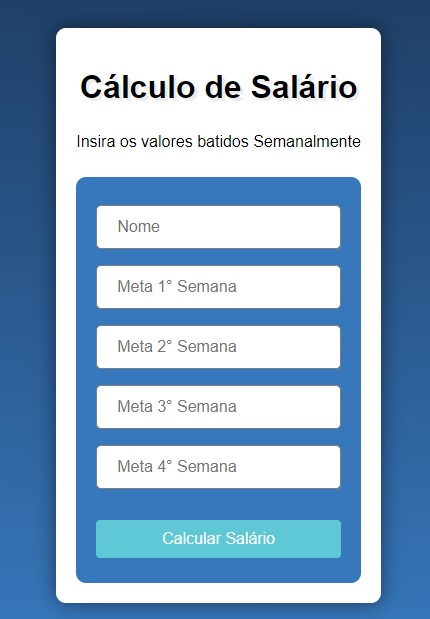

# Índice 

* [Projeto de Portfólio Pessoal](#projeto-de-portifolio-pessoal)
* [Introdução](#introdu%C3%A7%C3%A3o)  
* [Funcionalidades](#funcioanlidades)  
* [Tecnologia Utilizadas](#tecnologia-utilizadas)  
* [Fontes Consultadas](#fontes-consultadas)  
* [Autores](#autores)  

# Sistema-de-Cálculo-Salarial

Projeto criado com base em atividade da atividade de Programação Web II. Escola Social Marista Ir. Acácio - Ensino Médio Técnico.

## Introdução
Em atividade proposta pelo professor Leonardo em sala de aula, tivemos que calcular o salário de funcionarios de uma empresa fictícia, no qual teriamos os valores da meta semanal, mensal e possíveis bônus mensais para aqueles que batessem as metas semanais, em tal atividade receberiamos o nome do usuário/funcionario, as metas semanais que foram batidas pos ele(a) e a mensal. Apartir disso, e das informações passada pela empresa seria feito o cálculo do salário do funcionario.

A empresa definiu o seguinte:
Todo(a) vendedor(a) tem salário mínimo de 1.927,02 como pagamento base pelos serviços prestados.  
Todo(a) vendedor(a) tem meta de venda semanal. Essa meta é de 20 mil reais, totalizando 80 mil/mês por vendedor(a).
Todo(a) vendedor(a) que bater a meta receberá 1% do valor da meta.
Todo(a) vendedor(a) que ultrapassar as metas semanais, receberão um 5% sobre o excedente da meta semanal.
Todo(a) vendedor(a) que exceder o volume da meta mensal, receberá uma bonificação, de 10% sobre o valor excedente da meta mensal. Isso NÃO valerá em caso do não cumprimento de ao menos uma das metas semanais.

## Funcioanlidades
O código constitui de alguns cálculos, no qual foi feito a confirmação dos parâmetros definidos pela empresa.

### 1%

### 5%

### 10%

### resultado

## Tecnologia Utilizadas
- :heavy_check_mark: [HTML]
- :heavy_check_mark: [CSS]
- :heavy_check_mark: [PHP]
- :heavy_check_mark: [GIT]

## Fontes Consultas
- W3Schools: [www.w3schools.com](https://www.w3schools.com/php/php_looping_foreach.asp)

## Autores
Aluno: Caio Estevão
- Github: [github.com](https://github.com/Caioestevao1000)

### Auxílio
Professor: Leonardo Rocha
- Github: [github.com](https://github.com/LeonardoRochaMarista)
