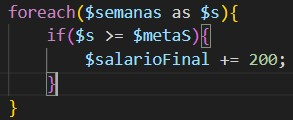
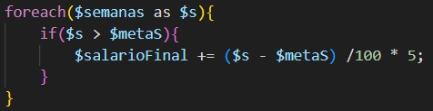
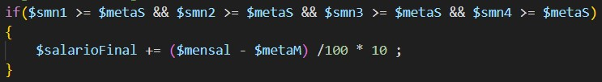
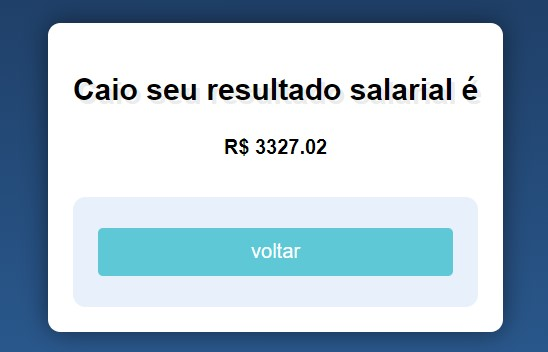

# Índice 

* [Sistema de Cálculo Salarial](#sistema-de-cálculo-salarial)
* [Introdução](#introdu%C3%A7%C3%A3o)  
* [Funcionalidades](#funcionalidades)  
* [Tecnologia Utilizadas](#tecnologia-utilizadas)  
* [Fontes Consultadas](#fontes-consultadas)  
* [Autor](#autor)  

# Sistema de Cálculo Salarial

Projeto criado com base em atividade da atividade de Programação Web II. Escola Social Marista Ir. Acácio - Ensino Médio Técnico.

## Introdução
Em atividade proposta pelo professor Leonardo em sala de aula, tivemos que calcular o salário de funcionarios de uma empresa fictícia, no qual teriamos os valores da meta semanal, mensal e possíveis bônus mensais para aqueles que batessem as metas semanais, em tal atividade receberiamos o nome do usuário/funcionario, as metas semanais que foram batidas pos ele(a) e a mensal. Apartir disso, e das informações passada pela empresa seria feito o cálculo do salário do funcionario.

A empresa definiu o seguinte:  
Todo(a) vendedor(a) tem salário mínimo de 1.927,02 como pagamento base pelos serviços prestados.    
Todo(a) vendedor(a) tem meta de venda semanal. Essa meta é de 20 mil reais, totalizando 80 mil/mês por vendedor(a).  
Todo(a) vendedor(a) que bater a meta receberá 1% do valor da meta.  
Todo(a) vendedor(a) que ultrapassar as metas semanais, receberão um 5% sobre o excedente da meta semanal.  
Todo(a) vendedor(a) que exceder o volume da meta mensal, receberá uma bonificação, de 10% sobre o valor excedente da meta mensal. Isso NÃO valerá em caso do não cumprimento de ao menos uma das metas semanais.

## Funcionalidades
O código constitui de alguns cálculos, no qual, foi de acordo com os parâmetros definidos pela empresa. A seguir é demonstrado as funcionalidades princípais do código.

### Cálculos

#### 1%
  
Cálculo para saber se as metas da semana foram maior ou igual á 20.000, caso seja, é adicionado 200 no Salário Final, que é igual a 1% de 20.000.

#### 5%
  
Aqui é pego cada semana e cálculado se houve excedente ou não. Meta semanal=20.000, se igual, não houve excedente, se maior é subtraido por 20.000 e pego 5% do excedente.

#### 10%
  
Cálculo para o excedente mensal, se algumas das metas semanais não forem alcançadas não será feito o cálculo do bônus mensal, caso alcançado será subtraido por 80.000 e pego 10% do valor excedente.

### Resultado
  
Após a realização de todos os cáculos, será apresentado para o funcionario o salário que ele receberá.

## Tecnologia Utilizadas
- :heavy_check_mark: [HTML]
- :heavy_check_mark: [CSS]
- :heavy_check_mark: [PHP]
- :heavy_check_mark: [GIT]

## Fontes Consultas
- W3Schools: [www.w3schools.com](https://www.w3schools.com/php/php_looping_foreach.asp)
- Paraná Governo do Estado: [www.aen.pr.gov.br/](https://www.aen.pr.gov.br/Noticia/Maior-do-Brasil-governador-confirma-novo-Piso-Regional-que-vai-de-R-18-mil-R-21-mil#:~:text=Na%20primeira%2C%20que%20contempla%20os,de%20R%24%201.927%2C02.)

## Autor
Aluno: Caio Estevão
- Github: [github.com](https://github.com/Caioestevao1000)

### Auxílio
Professor: Leonardo Rocha
- Github: [github.com](https://github.com/LeonardoRochaMarista)
